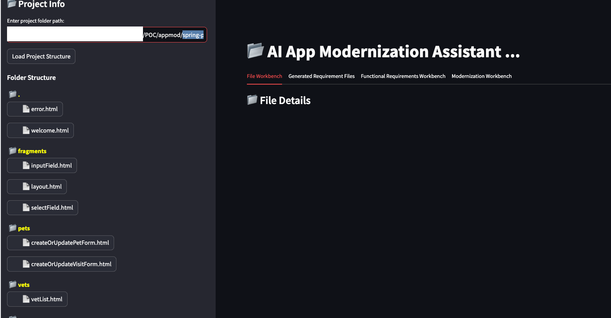
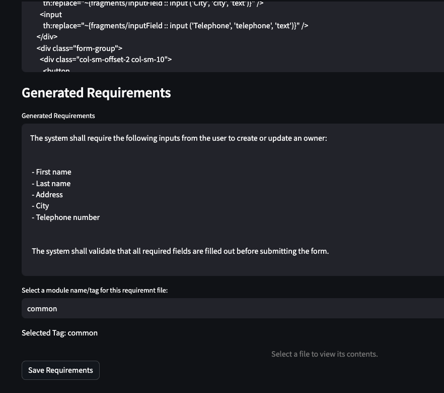
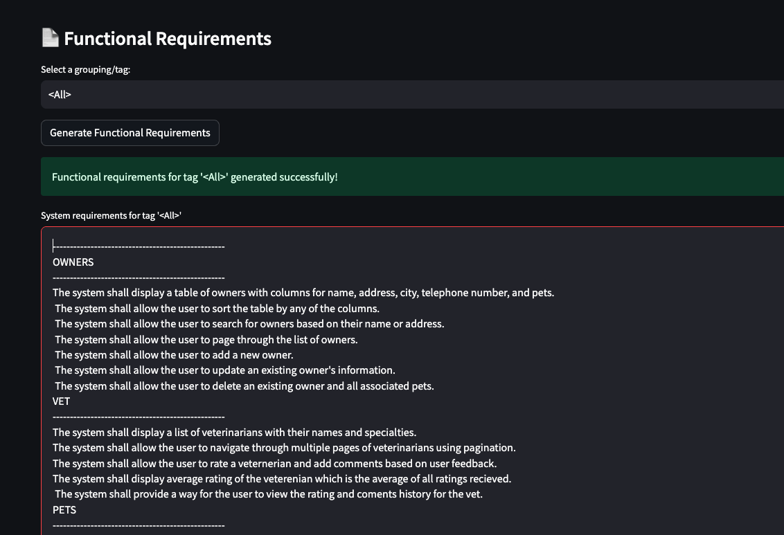
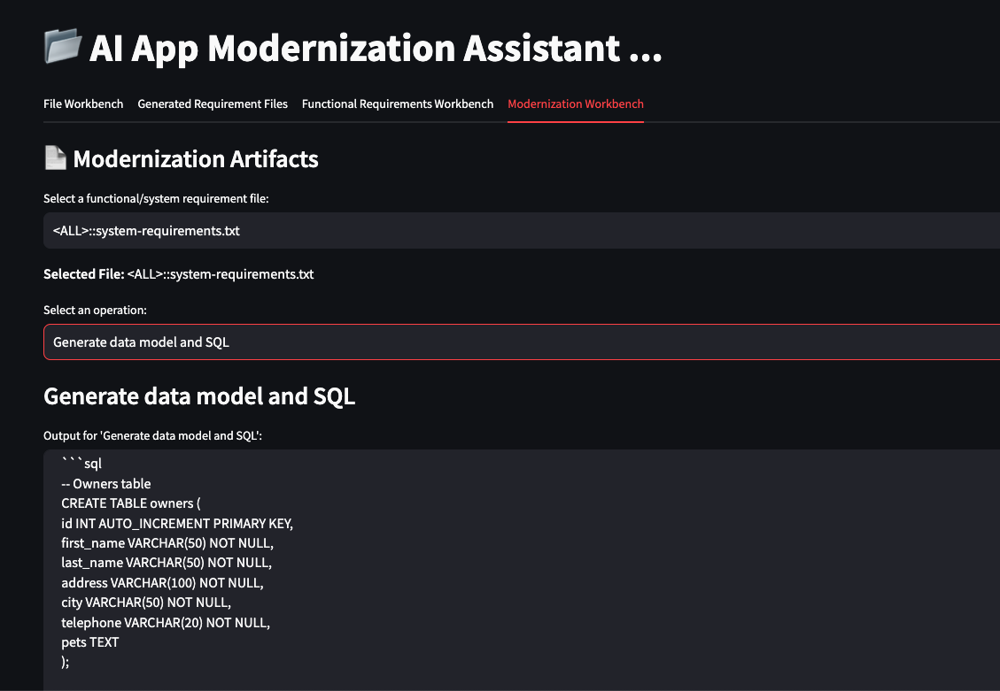
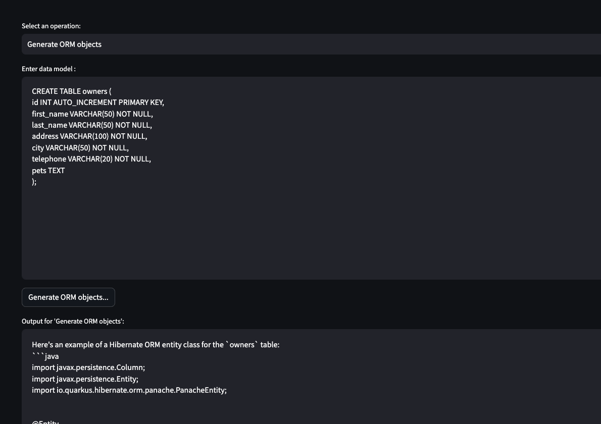
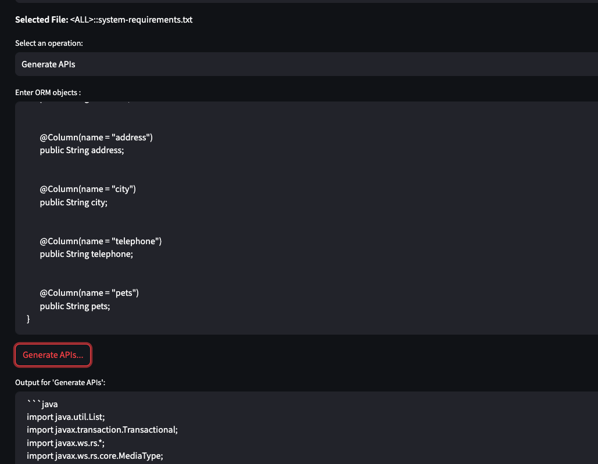
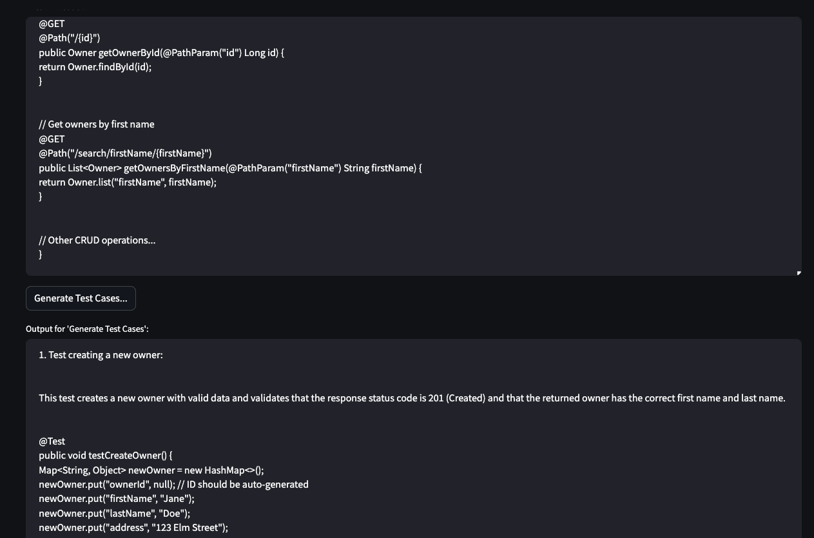
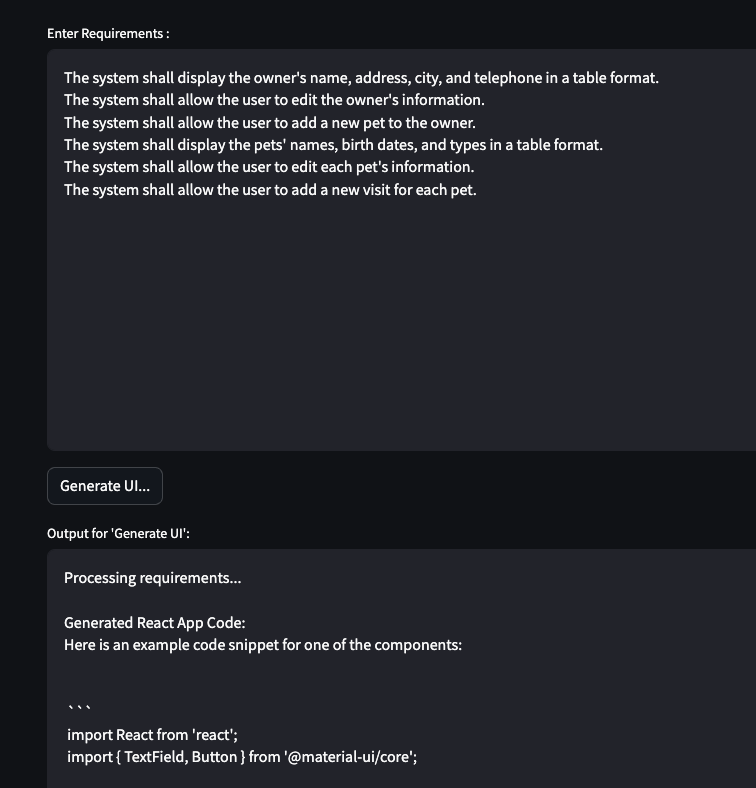

# Application Modernization Framework Reference Implementation

This comprehensive guide provides step-by-step instructions for configuring and running the App modernization reference implementation tool. This tool was developed by LLM using progressive prompting technique with minimal edits. It can be deployed and run on local machine and can be modified to work with your model of choice with minimal code changes.
The following is the sysem specification that I used for this project, I do believe a lower configuration will work just fine.

**System Specifications:**

- Device: MacBook Pro
- Chip: Apple M2 Pro
- RAM: 32 GB 

## Prerequisites

1.  Install Python and pip if it is not already installed. You need Python version 3.8 or higher.

2. Download this code repository (install git if it is not already setup, You can also downlod the zip file directly from the main page under code option as an alternate)

3. Download and serve the grantile codel model in InstructLab as shown below. Make sure the context length (max_ctx_size) is set to a higher number e.g. 100k in the config.yaml file.
```
  $ ilab model serve --model-path models/granite-8b-code-instruct-128k.Q5_K_M.gguf
```
4. Download the Spring-petclinic application from **https://github.com/spring-projects/spring-petclinic/tree/main?tab=readme-ov-file**
5. In a new terminal start the application
```
  $ streamlit run requirements_manager_ui.py
```
>[!WARNING]
>This tool is a reference implementation of the proposed app modernization framework. Necessary updates must be made to extend this for entperise use.
> 
## Generating Requirements for Legacy Application

1. Enter the folder path for the Spring petclinic application and Load the project structure e.g. spring-petclinic/src/main/resources/templates (User Interface layer)


2. Select **createOrUpdateOwnerForm.html** under owners folder and click on **Generate Requirements** button on **File Workbench** tab. The system will display the generated requirements in a text box, make necessary changes and save the requirments by adding a new module name called "Owners" from the "Select a module name/tag" drop down.
    

3. Repeat the process and save generated requirements for all files under owners, pets and vets folders. Make sure to enter/select the appropriate module name before saving the requiements. e.g. All requirement files under vets should be saved with **vets** as the module name etc. **This step is important to group the related requirments together in the following steps.**

>[!NOTE]
>You may use the **Generated Requirement Files** tab functionality to edit the requirement files at any time once the requirements are created.
 
4. Navigate to the **Functional Requirements Workbench** tab. Select "<All>" as the grouping name and click on ** Generate Functional Requirements ** button to generate consolidated requirements for owners, pets and vets interaction layer. Review, make necessary edit/ add new requirements and save the requirements file.


>[!NOTE]
>Depending on your project, you may also want to generate functional requirements for other layers such as business logic tier, partner APIs and batch scripts.

## Generating Artifacts for the new Application

### This reference implementation gerenates Quarkus framework as the target application framework.

5. Navigate to the **Moderization Workbench** tab. Select the newly created requirements file **<ALL>::system-requirements.txt** from the drop down and select **Generate data model and SQL** option from the second drop down. The system will invoke the LLM and display the generated output. Review the output for completeness and save it.


6. Copy owners table sql script. Select **Generate ORM objects** from the second drop down and click on **Generate ORM objects**  button. Wait for the LLM response, review the output for accuracy and completeness and save the artifact.


7. Repeat the above step for generating API code by selecting **Generate APIs** as the operation in the second drop down and clicking on **Generate APIs ** button.
   

8. Repeat the above step for generating Test cases for the APIs by selecting **Generate Test Cases** as the operation in the second drop down and clicking on **Generate Test Cases** button.


9. The next step is to generate UI code, for this, select **Generate UI** as the operation from the second drop down, copy and paste the functional requirements of the desired screen (e.g.,**OWNERS::owners-ownerDetails.html-requirements.txt**)  in the **Enter Requirements** text box and click on **Generate UI** button.

